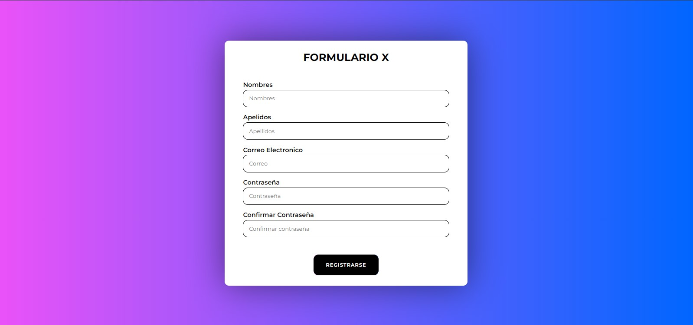

# Formulario de Registro de Usuarios

## Descripción del Proyecto

Este proyecto consiste en un formulario de registro de usuarios implementado con HTML, CSS y JavaScript Vanilla. El formulario incluye validación de datos, diseño responsivo y una interfaz de usuario atractiva.

## Características

- **Campos de Entrada**: Incluye campos para nombre, apellido, dirección de correo electrónico, contraseña y confirmación de contraseña.
- **Validación de Datos**: Verifica que las contraseñas coincidan y que la dirección de correo electrónico tenga un formato válido.
- **Botón de Enviar**: Permite a los usuarios enviar el formulario después de completarlo.
- **Diseño Atractivo**: Utiliza CSS para una presentación visualmente atractiva.
- **Responsividad**: Asegura una buena visualización en dispositivos de diferentes tamaños.

## Tecnologías Utilizadas

- HTML
- CSS
- JavaScript Vanilla
- Vite (para el entorno de desarrollo)

## Vista Previa del Proyecto

 <!-- Reemplaza 'url-de-la-imagen' con la URL de una captura de pantalla de tu proyecto -->

## Cómo Usar

1. Clona el repositorio: `git clone https://github.com/Danilo0203/formulario-academiaX.git`
2. Navega al directorio del proyecto: `cd nombre-del-directorio`
3. Instala las dependencias: `npm install`
4. Inicia el servidor de desarrollo: `npm run dev`
5. Abre tu navegador y visita `http://localhost:3000`.

## Demo en Vivo

Puedes ver una demostración en vivo del formulario de registro en [Este Enlace](url-del-demo-en-vivo)

## Contribuciones

Las contribuciones son siempre bienvenidas. Si tienes alguna sugerencia para mejorar este proyecto, no dudes en hacer un fork y enviar un pull request, o simplemente abre un issue en el repositorio.

